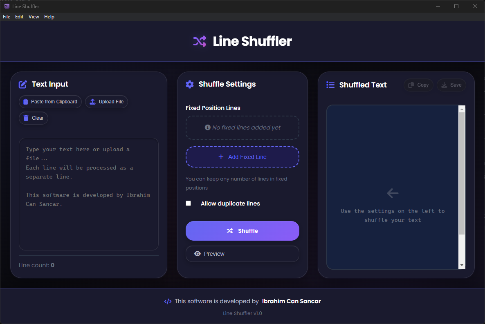

# 🔀 Line Shuffler

<div align="center">
  

  **A modern, feature-rich desktop application for shuffling text lines with advanced customization options.**
</div>

<div align="center">


</div>

## 📸 Screenshots

<div align="center">
  
  <br>
  <em>Clean, modern interface with dark theme</em>
</div>

## ✨ Features

### Core Functionality
- 🔀 **Advanced Line Shuffling** - Uses Fisher-Yates algorithm for true randomization
- 📌 **Fixed Position Lines** - Keep specific lines in fixed positions while shuffling others
- 📋 **Smart Clipboard Integration** - Auto-paste multi-line content with clipboard monitoring
- 💾 **File Operations** - Import/export text files (.txt format)
- 🎯 **Drag & Drop Support** - Simply drag files into the application

### 2025 Modern Features
- ⚡ **Smart Detection** - Automatically detects URLs and social media patterns
- ↩️ **Undo/Redo System** - Full history management with keyboard shortcuts
- 📊 **Statistics Tracking** - Monitor your shuffling activity with milestones
- ⌨️ **Keyboard Shortcuts** - Complete keyboard navigation support
- 🎨 **Modern UI Design** - Clean, responsive interface with smooth animations

### Advanced Options
- 🔄 **Allow Duplicates** - Option to include or exclude duplicate lines
- 👁️ **Preview Mode** - Preview shuffling results before applying
- 🎯 **Batch Processing** - Handle large text files efficiently
- 📱 **Responsive Design** - Works seamlessly on different screen sizes

## 🚀 Quick Start

### Prerequisites
- **Node.js** (v16 or higher)
- **npm** (v8 or higher)

### Installation

1. **Clone the repository**
   ```bash
   git clone https://github.com/ibrahimsancar/line-shuffler.git
   cd line-shuffler
   ```

2. **Install dependencies**
   ```bash
   npm install
   ```

3. **Run the application**
   ```bash
   npm start
   ```

### Building for Distribution

```bash
# Build for Windows
npm run build:win

# Build for macOS
npm run build:mac

# Build for Linux
npm run build:linux

# Build for all platforms
npm run build:all
```

## 💡 Usage

### Basic Shuffling
1. **Input Text** - Type or paste your text in the input area
2. **Configure** - Set up any fixed position lines if needed
3. **Shuffle** - Click the "Shuffle" button to randomize your text
4. **Export** - Copy to clipboard or save as a file

### Fixed Position Lines
- Click **"Add Fixed Line"** to add a line that stays in a specific position
- Select the line content and specify the target position
- Multiple fixed lines are supported

### Keyboard Shortcuts
- `Ctrl+Enter` - Shuffle lines
- `Ctrl+Shift+A` - Add new fixed line
- `Ctrl+Shift+C` - Copy output to clipboard
- `Ctrl+Z` - Undo last action
- `Ctrl+Shift+Z` - Redo last action
- `ESC` - Remove focus from input

### Smart Features
- **URL Detection** - Automatically detects when you're working with URLs
- **Social Media Detection** - Identifies social media account lists
- **Auto-paste** - Multi-line clipboard content is automatically pasted

## 🛠️ Technical Details

### Built With
- **[Electron](https://www.electronjs.org/)** - Cross-platform desktop framework
- **HTML5/CSS3** - Modern web technologies
- **JavaScript ES6+** - Latest JavaScript features
- **Fisher-Yates Algorithm** - Cryptographically sound shuffling

### Architecture
```
line-shuffler/
├── src/
│   ├── main.js              # Electron main process
│   └── renderer/            # Renderer process
│       ├── index.html       # Main UI
│       ├── style.css        # Modern styling
│       └── script.js        # Application logic
├── assets/                  # Static assets (logo, icons)
├── package.json             # Project configuration
├── README.md               # This file
├── CONTRIBUTING.md         # Contribution guidelines
├── CHANGELOG.md            # Version history
├── LICENSE                 # MIT License
└── .gitignore             # Git ignore rules
```

### Performance
- **Memory Efficient** - Optimized for large text files
- **Fast Processing** - Handles thousands of lines instantly
- **Responsive UI** - Smooth animations and interactions
- **History Management** - Smart memory usage for undo/redo

## 🎯 Use Cases

### Content Creation
- **Blog Posts** - Randomize paragraph order
- **Lists** - Shuffle bullet points or numbered items
- **Social Media** - Randomize posting schedules

### Development
- **Test Data** - Generate randomized test datasets
- **Documentation** - Shuffle FAQ items or feature lists
- **Configuration** - Randomize server lists or endpoints

### Education
- **Quizzes** - Randomize question order
- **Study Materials** - Shuffle flashcard content
- **Presentations** - Mix up slide sequences

### Data Processing
- **CSV Processing** - Randomize data rows
- **Log Analysis** - Shuffle log entries for sampling
- **URL Lists** - Randomize website crawling order

## 🤝 Contributing

We welcome contributions! Please see our [Contributing Guidelines](CONTRIBUTING.md) for details.

### Development Setup
1. Fork the repository
2. Create a feature branch: `git checkout -b feature-name`
3. Make your changes
4. Test thoroughly
5. Submit a pull request

### Code Style
- Use ES6+ features
- Follow existing naming conventions
- Add comments for complex logic
- Maintain responsive design principles

## 📝 License

This project is licensed under the MIT License - see the [LICENSE](LICENSE) file for details.

## 👨‍💻 Author

**Ibrahim Can Sancar**
- GitHub: [@ibrahimsancar](https://github.com/ibrahimsancar)
- Website: [Coming Soon]

## 🙏 Acknowledgments

- Fisher-Yates shuffle algorithm implementation
- Electron community for excellent documentation
- Modern CSS techniques and best practices
- Open source contributors and testers

## 📞 Support

If you encounter any issues or have questions:

1. Check the [Issues](https://github.com/ibrahimsancar/line-shuffler/issues) page
2. Create a new issue with detailed information
3. Include your OS, version, and steps to reproduce

## 🔄 Version History

- **v1.0** - Initial release with core features
  - Fisher-Yates shuffling algorithm
  - Fixed position lines support
  - Modern UI with dark theme
  - File import/export functionality
  - Clipboard integration
  - Undo/redo system
  - Smart detection features

---

⭐ **Star this repository if you find it useful!** ⭐
